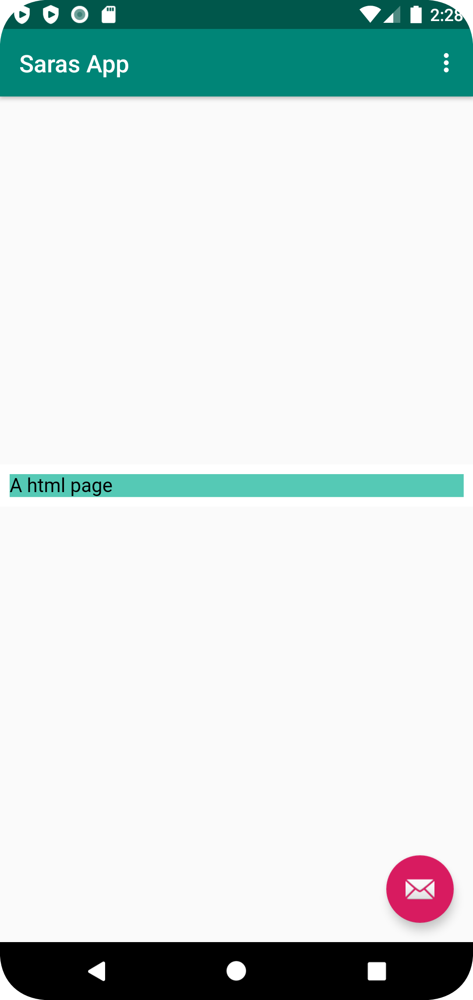

# Rapport

Lösningar:

Uppgift 2.
- Ändrat till <string name="app_name">Saras App</string> i strings.xml
Alltså bytt namn på appen.

Uppgift 3.
- Lagt till internet access <uses-permission android:name="android.permission.INTERNET" /> i AndroidManifest.xml
Alltså möjliggöra internet access till appen.

Uppgift 4.
- Bytt ut Textview element till Webview element i content_main.xml
Alltså lägga till WebView element genom att byta ut TextView element.

Uppgift 5.
- Lagt till id android:id="@+id/my_webview" i content_main.xml
Alltså lägga till ID för WebView elementet.

Uppgift 6-7.
- Lagt till private WebView myWebView; i MainActivity.java
- Lagt till myWebView=findViewById(R.id.my_webview); i oncreate(){} i MainActivity.java
- Lagt till private WebViewClient myWebViewClient; i MainActivity.java
- Lagt till myWebView.setWebViewClient(myWebViewClient); i MainActivity.java
Alltså lägga till private member variable och myWebViewClient som är instans av myWebView.

Uppgift 8.
- Lagt till myWebView.getSettings().setJavaScriptEnabled(true); i MainActivity.java
Alltså möjliggöra javascript utföranden.

Uppgift 9.
- Lagt till mappen assets och lagt in egenkomponerade dokumentet a_html_page.html
Alltså lagt till html-fil som asset.

Uppgift 10.
- Lagt till myWebView.loadUrl("https://wwwlab.iit.his.se/b21sarbo/WEBUG/a_html_page.html"); i MainActivity.java
- Lagt till myWebView.loadUrl("file:///android_asset/a_html_page.html"); i MainActivity.java
Alltså lagt till html-filen i appen.

Uppgift 11.
- Lagt till showExternalWebPage(); i oncreate(){} villkor i MainActivity.java
- Lagt till showInternalWebPage(); i oncreate(){} villkor i MainActivity.java
Alltså lagt till html-filen i appen som hämtas vid knapptryck.myWebView

Kodfiguren nedan i figur 1 visar java-koden i MainActivity.java som laddar in urlerna till html-filen som lades till i assets.
...
    public void showExternalWebPage(){
        myWebView.loadUrl("https://wwwlab.iit.his.se/b21sarbo/WEBUG/a_html_page.html");
    }

    public void showInternalWebPage(){
        myWebView.loadUrl("file:///android_asset/a_html_page.html");
    }
...
Figur 1, Java-kod som laddar in tillagd htm-fil för både internal och external knapp i appen

I figur 2 visas sidan som kommer upp när man trycker på external i appens meny.

Figur 2, screenshot från den externa sidan

I figur 3 visas sidan som kommer upp när man trycker på internal i appens meny.

Figur 3, screenshot från den externa sidan